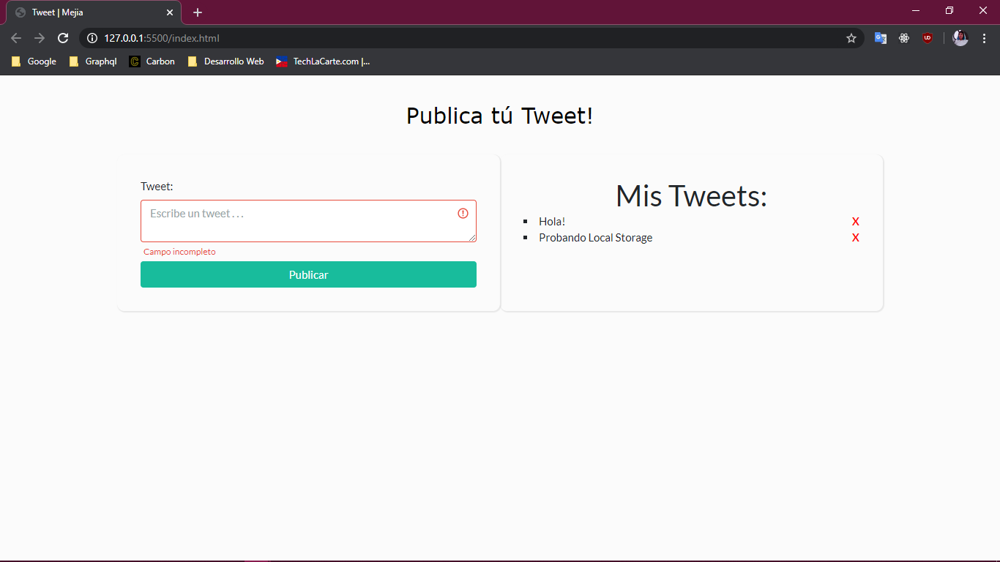

#Tweets con Local Storage

En este repositorio se incluye el código.
# Creado por:
* Eduardo Mejia ...

# Lenguajes usados

* html
* css
* javascript 

# Frameworks

* [bootstrap](https://getbootstrap.com/)

# Themes boostrap
* [bootstrap watch](https://bootswatch.com/)

* [Visual Studio Code](https://code.visualstudio.com/)
* [git](https://git-scm.com/)
